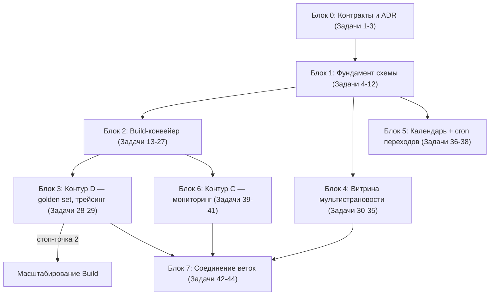

# План №1 — единый мастер-план InspectorX (мультистрановость + контент-фабрика)

> **For agentic workers:** REQUIRED SUB-SKILL: Use superpowers:subagent-driven-development (recommended) or superpowers:executing-plans to implement this plan task-by-task. Steps use checkbox (`- [ ]`) syntax for tracking.

**Цель:** превратить InspectorX из УЗ-витрины в мультистрановую compliance-платформу (УЗ + КЗ, затем ОАЭ) с работающим Build-конвейером контента, мониторингом изменений (контур C), инфраструктурой качества (контур D) и календарём дедлайнов — одной гигантской фазой, без искусственных остановок.

**Архитектура:** фундамент — миграции схемы (каталог ADR-0004 + jurisdiction + таблица категорий + lifecycle-даты) одним блоком в начале; поверх него параллельно строятся Python-конвейер в `importer/build/` (против моков LegalX) и витрина (табы стран, сравнение, чистка УЗ-терминологии — против KZ/UAE-фикстур); календарь — .ics-фид через Vercel-функцию + pg_cron; ветки InspectorX и LegalX соединяются в конце переключением `LEGALX_BACKEND=mock→live` с приёмкой на golden set.

**Стек:** Vite + React 19 + TS + Tailwind v4 (витрина) · Supabase Postgres/RLS/pg_cron/pg_net (данные) · Python 3 в `importer/` на Railway (конвейер) · GPT через API (агенты) · Vercel (деплой + serverless .ics).

## Глобальные ограничения (действуют для каждой задачи)

- **Источники истины и приоритет при конфликте:** `docs/TARGET_FORMAT.md` §4 → `docs/adr/0002…0005` → `docs/MASTER_PLAN_BRIEF.md` → этот план. Расхождения топологии — верен ADR-0002.
- **Вне плана:** фото-чек (контур B, отдельный репозиторий и фаза — решение брифа §1 от 02.08 приоритетнее «B — часть MVP» из ADR-0003); `docs/IDEAS.md` не кодировать без явного решения; судебные кейсы — только УЗ.
- **Миграции:** копятся в рабочей ветке; мёрж в `main` = автонакат на прод без отката (GitHub-интеграция Supabase) — мёржить только готовый, проверенный на `supabase db reset --local` блок.
- **В прод-БД напрямую не писать** — живые проверки прода делает Абдурахмон.
- **Объективные стоп-точки (единственные разрешённые):** ① апрув карты Cartographer владельцем (per-группа), ② golden set до масштабирования Build за пределы пилотных групп, ③ мёрж миграций только готовыми, ④ переключение mock→live — по готовности LegalX-зависимостей.
- Язык UI/комментариев/коммитов — русский (conventional commits: `feat(pipeline): …`); код и идентификаторы — английские. Все строки UI — только в `src/i18n/ru.ts`.
- Проверка фронта: `npm run build` (это же тайпчек) + `npm run lint` + `node scripts/shot.mjs` / `scripts/walkthrough.mjs`. Проверка Python: `.venv-importer/bin/python -m pytest importer/tests`.
- Коды стран — ISO 3166-1 alpha-2: `UZ`, `KZ`, `AE` (в UI: Узбекистан / Казахстан / ОАЭ). Языки контента — существующий enum `lang_code`: ru/uz/en (КЗ-контент — ru, ОАЭ — en; арабский не нужен).
- После запуска — правило заморозки `docs/LAUNCH_CHECKLIST.md`: только контент, новые фичи — через TARGET_FORMAT.

## Решения грил-сессии 02.08.2026 (входят в план как данность)

1. **Одна база LegalX** на все страны, колонка `jurisdiction`; запрет межстрановых FK и сшивающих вьюх (правило отселения — как для SudX в ADR-0002).
2. **Календарь — .ics-фид** (персональная ссылка-подписка), без OAuth Google; напоминания дублируются in-app.
3. **Таксономия категорий — справочная таблица** `requirement_categories` на базе UNCTAD NTM (сид — текущие 8 значений enum), названия ru/uz/en; она же — ось матрицы сравнения стран; расширение — только через апрув владельца.
4. **Матрица сравнения стран — бесплатная** (уровень тизера); пейволл-граница contents/details не меняется.
5. **Фундамент фазы** — каталог ADR-0004 + jurisdiction + категории + lifecycle-даты одним блоком миграций, первыми.
6. **Границы плана** — рабочий план этого репо; LegalX-задачи — внешние зависимости (список ниже), до их готовности всё строится против моков с теми же сигнатурами.

## Внешние зависимости (ветка LegalX — отдельные сессии; это ТЗ для них)

| # | Зависимость | Что именно ждём | Что блокирует |
|---|---|---|---|
| D1 | `search_norms` починен + параметр `jurisdiction` | RPC по сигнатуре Контракта 1 (Задача 1); гибрид pgvector+FTS+метафильтры; различимый пустой результат | Переключение Retriever на live (Задача 42); до этого — мок |
| D2 | Колонка `jurisdiction` в актах/фрагментах LegalX + данные КЗ | Акты КЗ загружены и ищутся | Пилот Казахстана (Задача 43) |
| D3 | Webhook изменений country-aware | POST по Контракту 3 (Задача 1) на `ingest_change_event` (Задача 39) | Живой контур C (до этого — тестовые события) |
| D4 | Версионирование актов | История редакций фрагмента по API/RPC | Задача 41 (provision change history) на live |
| D5 | RPC `search_cases` (схема `court`, только УЗ) | Сигнатура Контракта 2 (Задача 1) | Живые кейсы в Задаче 22; до этого — мок |

**Первая задача LegalX-ветки — D1** (иначе golden set ничего не покажет — приоритет из брифа §2).

## Карта блоков и зависимости



Блоки 2 и 4 независимы друг от друга — можно вести параллельно. Блок 3 встроен в Блок 2 как гейт масштабирования. Точная нумерация задач — ниже.

---

# Блок 0 — Контракты и фиксация решений

### Задача 1: Обновить ADR-0005 — точные сигнатуры контрактов

**Files:**
- Modify: `docs/adr/0005-ecosystem-contracts.md`

**Interfaces (Produces):** канонические сигнатуры, на которые ссылаются мок (Задача 3), Retriever (Задачи 17, 21, 22) и приём webhook (Задача 39).

- [ ] **Шаг 1: Зафиксировать Контракт 1 — `search_norms`** (заменить draft-формулировку):

```sql
-- RPC в Supabase LegalX, вызывается воркером InspectorX под read-only ролью
search_norms(
  p_query        text,          -- поисковый запрос
  p_jurisdiction text,          -- 'UZ' | 'KZ' | 'AE' (ISO 3166-1 alpha-2), ОБЯЗАТЕЛЕН
  p_domains      text[] default null,  -- метафильтр по доменам права
  p_limit        int default 10
) returns table (
  fragment_id uuid, act_id uuid,
  act_title text,               -- полное название акта
  article_ref text,             -- номер статьи/пункта
  anchor text,                  -- якорь для deep-link на параграф
  content text,                 -- текст фрагмента (uz-оригинал + ru-перевод, если есть)
  act_status text,              -- active | repealed | pending
  valid_from date, valid_to date,
  score float
)
-- Пустой результат = «поиск не нашёл». Семантику «нормы нет в стране»
-- определяет Retriever итеративно (N переформулировок), не RPC.
```

- [ ] **Шаг 2: Зафиксировать Контракт 2 — `search_cases`** (без изменений по сути, только сигнатура):

```sql
search_cases(p_article text, p_topic text default null, p_limit int default 5)
returns table (case_url text, case_title text, summary text, outcome text, amount numeric)
-- Только УЗ (схема court). Параметра jurisdiction НЕТ намеренно.
```

- [ ] **Шаг 3: Зафиксировать Контракт 3 — webhook изменений (country-aware)**. Тело POST от LegalX (pg_net) на PostgREST-RPC `ingest_change_event` InspectorX:

```json
{
  "secret": "<из Vault LegalX>",
  "jurisdiction": "UZ",
  "act_id": "<uuid в LegalX>",
  "fragment_ids": ["<uuid>"],
  "change_type": "new | amended | repealed | effective_soon",
  "effective_date": "2027-01-01",
  "summary": "краткое описание изменения"
}
```

- [ ] **Шаг 4: Дописать решение «одна база LegalX + jurisdiction»** в ADR-0005 (раздел «Топология данных контрактов»): одна база, колонка `jurisdiction`, запрет межстрановых FK/вьюх; ссылка на ADR-0002 (правила отселения).
- [ ] **Шаг 5: Коммит** `docs(adr): финальные сигнатуры контрактов LegalX + решение об одной базе с jurisdiction`

### Задача 2: ADR-0006 — модель мультистрановости

**Files:**
- Create: `docs/adr/0006-multicountry.md`

- [ ] **Шаг 1: Написать ADR** со статусом «принято 02.08.2026», фиксирующий решения грил-сессии: страна как переключатель (табы на карточке товара), сравнение на уровне продукта и бесплатно, таблица `requirement_categories` (NTM-базис, двухуровневая карта Cartographer: мир → страна), `jurisdiction` в `requirements`/`change_events`, календарь через .ics-фид, языки контента per-страна (UZ: ru+uz; KZ: ru; AE: en). Перечислить, каких таблиц НЕ касается мультистрановость (profiles, chosen_products — юзер один на все страны).
- [ ] **Шаг 2: Коммит** `docs(adr): ADR-0006 — модель мультистрановости (страна как переключатель)`

### Задача 3: Мок-клиент LegalX/SudX с контрактными сигнатурами

**Files:**
- Create: `importer/build/__init__.py`, `importer/build/legalx.py`, `importer/build/legalx_mock.py`
- Create: `importer/tests/build/test_legalx_mock.py`
- Test-фикстуры: `importer/build/fixtures/norms_uz.json`, `norms_kz.json`, `cases_uz.json`

**Interfaces (Produces):**

```python
# importer/build/legalx.py
@dataclass
class NormFragment:
    fragment_id: str; act_id: str; act_title: str; article_ref: str
    anchor: str; content: str; act_status: str
    valid_from: date | None; valid_to: date | None; score: float

@dataclass
class CourtCase:
    case_url: str; case_title: str; summary: str; outcome: str; amount: Decimal | None

class LegalXClient(Protocol):
    def search_norms(self, query: str, jurisdiction: str,
                     domains: list[str] | None = None, limit: int = 10) -> list[NormFragment]: ...
    def search_cases(self, article: str, topic: str | None = None,
                     limit: int = 5) -> list[CourtCase]: ...

def get_client() -> LegalXClient:  # env LEGALX_BACKEND=mock|live; live добавляется в Задаче 40
```

- [ ] **Шаг 1: Написать падающий тест** `test_legalx_mock.py`: мок возвращает ≥1 фрагмент для запроса «акцизная марка табак» с `jurisdiction='UZ'`; пустой список для `jurisdiction='KZ'` (KZ-фикстуры пока пустые); `search_cases('ст. 204 КоАО')` возвращает ≤5 кейсов; `get_client()` при `LEGALX_BACKEND=mock` возвращает мок, при неизвестном значении — `ValueError`.
- [ ] **Шаг 2: Прогнать** `.venv-importer/bin/python -m pytest importer/tests/build/test_legalx_mock.py -v` → FAIL (модулей нет).
- [ ] **Шаг 3: Реализовать** dataclass'ы, Protocol, `MockLegalX` (простое ранжирование фикстур по пересечению слов) и `get_client()`. Фикстуры UZ — 8–10 реальных фрагментов, выписанных из уже опубликованного контента сигарет (акцизная марка, маркировка, сертификация — взять verbatim-цитаты из `supabase/migrations/20260711130000_v1_content.sql`), чтобы мок был содержательным для пилотного прогона.
- [ ] **Шаг 4: Прогнать тесты** → PASS.
- [ ] **Шаг 5: Коммит** `feat(pipeline): мок-клиент LegalX/SudX по контрактам ADR-0005`

---

# Блок 1 — Фундамент схемы (все миграции — одна ветка, мёрж целиком)

> Все задачи блока пишут файлы в `supabase/migrations/` и проверяются локально: `supabase db start && supabase db reset --local`. Мёрж в `main` — только после Задачи 12 (стоп-точка ③).

### Задача 4: Схема `catalog` — product_types, country_codes, skus (ADR-0004)

**Files:**
- Create: `supabase/migrations/20260803100000_catalog_schema.sql`

**Interfaces (Produces):** `catalog.product_types(id, kind, hs_code, unspsc_code, parent_id, name_ru/uz/en)`, `catalog.country_codes(country, system, code, product_type_id)`, `catalog.skus(ikpu_code, product_type_id, …)` — на них ссылаются Задачи 5, 7, 20, 31.

- [ ] **Шаг 1: Написать миграцию:**

```sql
create schema if not exists catalog;

create table catalog.product_types (
  id uuid primary key default gen_random_uuid(),
  kind text not null check (kind in ('good','service')),
  hs_code text unique check (hs_code ~ '^\d{6}$'),        -- товары: HS6 (WCO)
  unspsc_code text unique check (unspsc_code ~ '^\d{8}$'),-- услуги: UNSPSC
  parent_id uuid references catalog.product_types(id),
  name_ru text not null, name_uz text, name_en text,
  created_at timestamptz not null default now(),
  check ((kind = 'good' and hs_code is not null and unspsc_code is null)
      or (kind = 'service' and unspsc_code is not null and hs_code is null))
);

create table catalog.country_codes (        -- национальные слои кодов
  id uuid primary key default gen_random_uuid(),
  country text not null check (country ~ '^[A-Z]{2}$'),
  system text not null,                     -- 'ikpu' | 'tnved' | 'oked' | 'hts' | …
  code text not null,
  name text,
  product_type_id uuid references catalog.product_types(id),
  unique (country, system, code)
);
create index on catalog.country_codes (product_type_id);

create table catalog.skus (                 -- только товары, только страны с фискальным каталогом
  id uuid primary key default gen_random_uuid(),
  country text not null default 'UZ' check (country ~ '^[A-Z]{2}$'),
  ikpu_code text not null check (ikpu_code ~ '^\d{17}$'),
  brand text, attribute text, barcode text,
  product_type_id uuid not null references catalog.product_types(id),
  unique (country, ikpu_code)
);
```

- [ ] **Шаг 2: RLS:** read-only для anon/authenticated на все три таблицы (справочники публичные), запись — только service role.
- [ ] **Шаг 3: Проверить** `supabase db reset --local` → без ошибок.
- [ ] **Шаг 4: Коммит** `feat(db): схема catalog по ADR-0004 (product_types + country_codes + skus)`

### Задача 5: Сид каталога и привязка существующих товаров/услуг

**Files:**
- Create: `scripts/generate_catalog_seed.mjs`
- Create: `supabase/migrations/20260803110000_catalog_seed.sql` (генерируется скриптом)

- [ ] **Шаг 1: Написать скрипт-генератор** по образцу `scripts/generate_services_seed.mjs`: читает существующие `products.hs_code` и `services` (oked_code/ikpu_code) из `v1_content`/`services_content` миграций, строит для каждого уникального HS6-префикса строку `catalog.product_types (kind='good')`, для каждой услуги — `kind='service'` (UNSPSC-код подобрать по таблице соответствия внутри скрипта: аптека 47.73 → UNSPSC `85121600` «Pharmacists», кафе 56.10 → `90101600` «Ресторанные услуги»; таблица соответствий — константа в скрипте, расширяется по мере надобности), и национальные слои: `country_codes (country='UZ', system='tnved'|'ikpu'|'oked')`.
- [ ] **Шаг 2: Сгенерировать миграцию**, проверить глазами первые 20 строк (имена — из `products.name_ru`).
- [ ] **Шаг 3: Добавить в миграцию колонку-мост:** `alter table public.products add column product_type_id uuid references catalog.product_types(id);` + `update` по совпадению hs_code; то же для `services`. Проверить локально: `select count(*) from products where product_type_id is null` → 0.
- [ ] **Шаг 4: Коммит** `feat(db): сид каталога из текущих товаров и услуг + мост product_type_id`

### Задача 6: `jurisdiction` в requirements и change_events

**Files:**
- Create: `supabase/migrations/20260803120000_jurisdiction.sql`

**Interfaces (Produces):** `requirements.jurisdiction`, `change_events.jurisdiction` — используют все задачи Блоков 2, 4, 6.

- [ ] **Шаг 1: Миграция:**

```sql
alter table public.requirements
  add column jurisdiction text not null default 'UZ' check (jurisdiction ~ '^[A-Z]{2}$');
create index on public.requirements (jurisdiction);

alter table public.change_events
  add column jurisdiction text not null default 'UZ' check (jurisdiction ~ '^[A-Z]{2}$');
```

Контент contents/details/scope наследует страну через FK `requirement_id` — своих колонок не получает (решение ADR-0006).

- [ ] **Шаг 2: Проверить локально** reset + `select jurisdiction, count(*) from requirements group by 1` → все 'UZ'.
- [ ] **Шаг 3: Коммит** `feat(db): jurisdiction в requirements и change_events (default UZ)`

### Задача 7: Scope требований → product_type_id

**Files:**
- Create: `supabase/migrations/20260803130000_scope_product_type.sql`

- [ ] **Шаг 1: Миграция:** добавить в `requirement_applicability` колонку `product_type_id uuid references catalog.product_types(id)`, расширить enum-механику: scope `product_type` (привязка к типу — канонический путь по ADR-0004); бэкофилл: для существующих строк с `hs_code`/`ikpu_code`/`oked_code` найти `product_type_id` через `catalog.country_codes` и проставить. Старые колонки scope/code НЕ удалять (переходный период; удаление — отдельной миграцией после приёмки Блока 4).
- [ ] **Шаг 2: Проверить локально:** `select count(*) from requirement_applicability where product_type_id is null and scope not in ('all_products','all_services')` → 0.
- [ ] **Шаг 3: Коммит** `feat(db): scope требований через product_type_id (бэкофилл, старые коды сохранены)`

### Задача 8: Таблица категорий requirement_categories (вместо enum)

**Files:**
- Create: `supabase/migrations/20260803140000_requirement_categories.sql`

**Interfaces (Produces):** `requirement_categories(slug pk, name_ru/uz/en, definition_ru, sort_order, is_active)`, `requirements.category_slug` — ось сравнения (Задача 32), уровень «мир» карты Cartographer (Задача 15).

- [ ] **Шаг 1: Миграция:**

```sql
create table public.requirement_categories (
  slug text primary key,
  name_ru text not null, name_uz text, name_en text,
  definition_ru text,            -- «что сюда входит» — инструкция для Classifier и Cartographer
  sort_order int not null default 0,
  is_active boolean not null default true
);
insert into public.requirement_categories (slug, name_ru, name_en, sort_order) values
  ('sps',      'Санитарные и фитосанитарные', 'Sanitary & phytosanitary', 10),
  ('tbt',      'Техрегламенты и сертификация','Technical regulations & certification', 20),
  ('marking',  'Маркировка и упаковка',       'Marking & packaging', 30),
  ('licensing','Лицензии и разрешения',       'Licensing & permits', 40),
  ('fiscal',   'Налоги и фискальные',         'Fiscal & tax', 50),
  ('currency', 'Валютный контроль',           'Currency control', 60),
  ('customs',  'Таможенные процедуры',        'Customs procedures', 70),
  ('origin',   'Правила происхождения',       'Rules of origin', 80);

alter table public.requirements
  add column category_slug text references public.requirement_categories(slug);
update public.requirements set category_slug = requirement_category::text
  where requirement_category is not null;
```

Enum-колонку `requirement_category` не удалять до конца фазы (читатели в `real.ts`); RLS: категории читают все.

- [ ] **Шаг 2: Проверить локально:** число строк с `category_slug is not null` = числу с `requirement_category is not null`.
- [ ] **Шаг 3: Коммит** `feat(db): справочник requirement_categories (NTM-базис) + category_slug`

### Задача 9: Lifecycle-даты + вычисляемый статус

**Files:**
- Create: `supabase/migrations/20260803150000_lifecycle.sql`

**Interfaces (Produces):** колонки дат на `requirements`; функция `lifecycle_status(...)`; view `requirements_with_status` — используют Задачи 20 (экстрактор), 26 (Assembler), 31 (витрина), 37-серия (cron переходов), календарь.

- [ ] **Шаг 1: Миграция:**

```sql
alter table public.requirements
  add column effective_from  date,   -- вступление в силу
  add column transition_until date,  -- конец переходного периода
  add column valid_to        date,   -- утрата силы
  add column repealed_by_ref text;   -- реквизит отменяющего акта (текст: акт в LegalX)

create or replace function public.lifecycle_status(
  p_effective_from date, p_transition_until date, p_valid_to date,
  p_today date default current_date
) returns text language sql immutable as $$
  select case
    when p_valid_to is not null and p_today >= p_valid_to then 'repealed'
    when p_valid_to is not null
         and p_today >= p_valid_to - 60 then 'expiring'      -- окно 60 дней, константа
    when p_effective_from is not null and p_today < p_effective_from then 'upcoming'
    when p_transition_until is not null and p_today <= p_transition_until then 'transitional'
    else 'in_force'
  end
$$;

create view public.requirements_with_status as
  select r.*, public.lifecycle_status(r.effective_from, r.transition_until, r.valid_to) as lifecycle
  from public.requirements r;
```

Статус текстом нигде не хранится (TARGET_FORMAT §4а). RLS view наследует от requirements (`security_invoker = true`).

- [ ] **Шаг 2: Проверить локально** тремя контрольными запросами: `select lifecycle_status('2027-01-01', null, null)` → `upcoming`; `select lifecycle_status('2020-01-01','2020-06-01',null)` → `in_force`; `select lifecycle_status(null,null,current_date)` → `repealed`.
- [ ] **Шаг 3: Коммит** `feat(db): даты жизненного цикла + вычисляемый lifecycle-статус (view)`

### Задача 10: Расширение requirement_details и машинные правила

**Files:**
- Create: `supabase/migrations/20260803160000_details_rules.sql`

**Interfaces (Produces):** `requirement_details.court_cases/templates/lawyer_instruction/status_note`; таблица `requirement_rules` — пишут Задачи 19, 22–24, 26; читает витрина (Задача 31).

- [ ] **Шаг 1: Миграция:**

```sql
alter table public.requirement_details
  add column court_cases jsonb,         -- [{case_url, case_title, summary, outcome, amount}] ≤5, снапшот SudX
  add column templates jsonb,           -- [{name, source_url, note}] от Template hunter
  add column lawyer_instruction jsonb,  -- {verdict, steps: [text]} от In-house lawyer
  add column status_note text;          -- пояснение юриста к бейджу статуса («что успеть до даты X»)

create table public.requirement_rules ( -- машинно-проверяемые правила (Rule-maker)
  id uuid primary key default gen_random_uuid(),
  requirement_id uuid not null references public.requirements(id) on delete cascade,
  rule jsonb not null,                  -- {"field":"состав","lang":"uz","required":true} | {"barcode":"EAN-13"} | …
  verified boolean not null default false,
  created_at timestamptz not null default now()
);
```

RLS `requirement_rules`: чтение — как `requirement_details` (подписчики); запись — service role. Пустой блок на витрине → «Данных пока нет» (TARGET_FORMAT §4в) — рендерится при `null`.

- [ ] **Шаг 2: Проверить** reset локально.
- [ ] **Шаг 3: Коммит** `feat(db): court_cases/templates/instruction в details + таблица requirement_rules`

### Задача 11: Схема pipeline — учёт на айтем (ADR-0003 «Последствия»)

**Files:**
- Create: `supabase/migrations/20260803170000_pipeline_schema.sql`

**Interfaces (Produces):** `pipeline.runs`, `pipeline.items`, `pipeline.maps`, `pipeline.verdicts`, `pipeline.llm_calls` — состояние оркестратора (Задачи 13–27), трейсинг (Задача 29).

- [ ] **Шаг 1: Миграция:**

```sql
create schema if not exists pipeline;

create table pipeline.maps (               -- карта группы (двухуровневая: мир → страна)
  id uuid primary key default gen_random_uuid(),
  group_ref text not null,                 -- HS6-префикс или UNSPSC-сегмент
  jurisdiction text not null check (jurisdiction ~ '^[A-Z]{2}$'),
  status text not null default 'draft' check (status in ('draft','approved','rejected')),
  payload jsonb not null,                  -- [{expected_item, category_slug, rationale, benchmark_countries}]
  approved_at timestamptz, approved_by text,
  created_at timestamptz not null default now(),
  unique (group_ref, jurisdiction)
);

create table pipeline.runs (
  id uuid primary key default gen_random_uuid(),
  map_id uuid not null references pipeline.maps(id),
  status text not null default 'running' check (status in ('running','done','failed')),
  started_at timestamptz not null default now(), finished_at timestamptz
);

create table pipeline.items (              -- гранулярность учёта = айтем-требование
  id uuid primary key default gen_random_uuid(),
  run_id uuid not null references pipeline.runs(id),
  expected_item text not null,             -- из карты
  category_slug text references public.requirement_categories(slug),
  requirement_id uuid references public.requirements(id),
  status text not null default 'pending' check (status in
    ('pending','in_progress','draft_loaded','published','needs_attention','no_norm')),
  retry_count int not null default 0,
  last_error text,
  updated_at timestamptz not null default now()
);

create table pipeline.verdicts (           -- вердикты Verifier по шагам
  id uuid primary key default gen_random_uuid(),
  item_id uuid not null references pipeline.items(id),
  step text not null,                      -- 'norm' | 'summary' | 'category' | 'rule' | 'sanction' | 'cases' | 'samples' | 'translation'
  verdict text not null check (verdict in ('pass','fail')),
  reason text, model text,
  created_at timestamptz not null default now()
);

create table pipeline.llm_calls (          -- трейсинг + стоимость (контур D)
  id uuid primary key default gen_random_uuid(),
  run_id uuid references pipeline.runs(id), item_id uuid references pipeline.items(id),
  role text not null,                      -- 'retriever' | 'verifier' | 'classifier' | …
  model text not null,
  input_tokens int, output_tokens int, cost_usd numeric(10,5),
  created_at timestamptz not null default now()
);
```

Вся схема pipeline — только service role (RLS deny anon/authenticated).

- [ ] **Шаг 2: Проверить** reset локально.
- [ ] **Шаг 3: Коммит** `feat(db): схема pipeline — runs/items/maps/verdicts/llm_calls`

### Задача 12: Календарные токены + расширение user_notifications; мёрж блока

**Files:**
- Create: `supabase/migrations/20260803180000_calendar_notifications.sql`

**Interfaces (Produces):** `calendar_tokens`, view `user_deadline_events`, `user_notifications.kind` — используют .ics-фид и cron переходов (Блок 5).

- [ ] **Шаг 1: Миграция:**

```sql
create table public.calendar_tokens (
  user_id uuid primary key references auth.users(id) on delete cascade,
  token text not null unique default encode(gen_random_bytes(24), 'hex'),
  created_at timestamptz not null default now()
);
-- RLS: владелец видит/создаёт свой токен; чтение по токену — только service role (Vercel-функция)

alter table public.user_notifications
  add column kind text not null default 'change'
    check (kind in ('change','lifecycle','checklist_version')),
  add column payload jsonb,                       -- {event: 'came_into_force', date: …}
  alter column impact_id drop not null;           -- lifecycle-уведомления без impact

create view public.user_deadline_events as        -- будущие даты ЖЦ по товарам юзера
  select cp.user_id, r.id as requirement_id, r.jurisdiction,
         d.event_kind, d.event_date, rc.title
  from public.chosen_products cp
  join public.requirement_applicability ra on ra.product_type_id = coalesce(
       (select product_type_id from public.products p where p.id = cp.product_id),
       (select product_type_id from public.services s where s.id = cp.service_id))
  join public.requirements r on r.id = ra.requirement_id and r.status = 'published'
  join lateral (values
    ('effective_from', r.effective_from),
    ('transition_until', r.transition_until),
    ('valid_to', r.valid_to)
  ) as d(event_kind, event_date) on d.event_date is not null and d.event_date >= current_date
  join public.requirement_contents rc on rc.requirement_id = r.id and rc.lang = 'ru';
```

(Если `unique(user_id, impact_id)` мешает nullable — заменить на partial unique index `where impact_id is not null`.)

- [ ] **Шаг 2: Проверить** reset локально; smoke-запрос view на демо-юзере локального стека (см. `docs/…demo-lawyer` / `scripts/live-check.mjs`).
- [ ] **Шаг 3: Прогнать весь блок:** `supabase db reset --local` с нуля, затем `npm run build && npm run lint` (фронт не должен сломаться — он ещё не знает о новых колонках).
- [ ] **Шаг 4: Коммит** `feat(db): calendar_tokens + user_deadline_events + виды уведомлений`
- [ ] **Шаг 5: СТОП-ТОЧКА ③ — мёрж ветки миграций в main** (автонакат на прод). Перед мёржем показать Абдурахмону список миграций одним сообщением.

---

# Блок 2 — Build-конвейер (контур A) в `importer/build/`

> Все агенты — GPT через API (клиент уже есть в `importer/llm.py` — переиспользовать/расширить). Тиры моделей — конфиг `importer/build/models.yaml`: `cheap: gpt-5-mini`, `mid: gpt-5`, `expensive: gpt-5 (high reasoning)` — стартовые значения, финальный выбор по данным трейсинга (Задача 29), не заранее. Verifier всегда получает модель ≠ модели producer-шага. Тесты — pytest с замоканным LLM (паттерн уже есть в `importer/tests/`).

### Задача 13: Каркас generic-агентов и профилей

**Files:**
- Create: `importer/build/agents.py`, `importer/build/profiles.py`, `importer/build/models.yaml`
- Test: `importer/tests/build/test_agents.py`

**Interfaces (Produces):**

```python
@dataclass
class Profile:            # профиль generic-агента (ADR-0003, решение 3)
    name: str             # 'norm' | 'label' | 'sanctions' | 'cases' | 'samples' | 'translation'
    system_prompt: str
    response_schema: dict # JSON Schema ответа
    tier: str             # 'cheap' | 'mid' | 'expensive'

class Retriever:  def run(self, query: str, jurisdiction: str, profile: Profile) -> RetrieverResult
class Verifier:   def run(self, question: str, fragment: str, source: str, profile: Profile) -> Verdict
class Classifier: def run(self, text: str, profile: Profile) -> dict
class Summarizer: def run(self, fragment: str, profile: Profile) -> str

@dataclass
class RetrieverResult:
    outcome: Literal['found', 'no_norm', 'not_found']  # различаем «нормы нет» vs «поиск не нашёл»
    fragments: list[NormFragment]; queries_tried: list[str]

@dataclass
class Verdict: passed: bool; reason: str; model: str
```

- [ ] **Шаг 1: Тест:** Retriever с мок-LLM и мок-LegalX делает ≥2 переформулировки при пустом результате и возвращает `outcome='not_found'` только после исчерпания попыток; Verifier получает модель, отличную от модели producer (проверить по вызовам мока); Verifier НЕ получает в промпт рассуждения Retriever.
- [ ] **Шаг 2:** FAIL → реализация → PASS.
- [ ] **Шаг 3: Коммит** `feat(pipeline): generic-агенты с профилями (Retriever/Verifier/Classifier/Summarizer)`

### Задача 14: Оркестратор — state machine на pipeline.items

**Files:**
- Create: `importer/build/orchestrator.py`, `importer/build/steps.py`
- Modify: `importer/cli.py` (подкоманды `build …`)
- Test: `importer/tests/build/test_orchestrator.py`

**Interfaces (Produces):**

```python
STEP_ORDER = ['norm','summary','category','rule','scope','lifecycle',
              'sanctions','cases','samples','lawyer','translate','dedup','assemble','load','coverage']
class Orchestrator:
    def run_group(self, map_id: str) -> RunReport      # только по approved-карте
    def rerun_item(self, item_id: str, from_step: str) -> None  # частичный Build (для контура C)
```

CLI: `python -m importer build run --map <id>` · `build status --run <id>` · `build attention` (список needs-attention).

- [ ] **Шаг 1: Тест:** порядок шагов детерминирован (код, не LLM); при `verdict=fail` шаг ретраится, после `N=3` подряд фейлов айтем → `needs_attention` и конвейер НЕ публикует (fail-политика ADR-0003 р.4); `run_group` по карте со статусом `draft` → исключение «карта не апрувнута» (стоп-точка ①); статусы пишутся в `pipeline.items` через `importer/db.py`.
- [ ] **Шаг 2:** FAIL → реализация (LLM-менеджер исключений — заглушка-функция `escalate(item, reason)`, пишущая в needs_attention; полноценный менеджер — Задача 27) → PASS.
- [ ] **Шаг 3: Коммит** `feat(pipeline): оркестратор build — state machine, ретраи, needs-attention`

### Задача 15: Cartographer — двухуровневая карта + апрув

**Files:**
- Create: `importer/build/cartographer.py`
- Modify: `importer/cli.py`
- Test: `importer/tests/build/test_cartographer.py`

**Interfaces (Produces):** строка в `pipeline.maps` со схемой payload: `[{expected_item: str, category_slug: str, rationale: str, benchmark_countries: [str]}]`. `category_slug` обязан существовать в `requirement_categories` (уровень «мир»); `expected_item` — конкретика страны (уровень «страна»).

- [ ] **Шаг 1: Тест:** результат Cartographer с несуществующим `category_slug` отклоняется валидацией и попадает в отчёт «кандидат новой категории» (не создаёт категорию сам — расширение таксономии только через апрув, решение грила №3); `cli build approve-map --map <id>` переводит `draft→approved` и заполняет `approved_at/approved_by`.
- [ ] **Шаг 2:** FAIL → реализация: deep-research промпт (мировая практика + ~50 бенчмарк-стран, вход — группа `group_ref` + jurisdiction; expensive-тир, web-доступ через API), запись draft-карты, CLI approve/reject. → PASS.
- [ ] **Шаг 3: Смоук вручную:** прогнать Cartographer на пилотной группе `2402` (сигареты, UZ) — сверить карту с фактически опубликованными карточками сигарет (они — эталон полноты).
- [ ] **Шаг 4: Коммит** `feat(pipeline): Cartographer — двухуровневая карта группы + CLI-апрув (стоп-точка владельца)`

### Задача 16: Question writer

**Files:**
- Create: `importer/build/question_writer.py`
- Test: `importer/tests/build/test_question_writer.py`

**Interfaces (Produces):** `def write_questions(item: MapItem) -> list[Question]`, где `Question = {text: str, expected_schema: dict}` — потребляет Retriever/Норма (Задача 17… в составе steps).

- [ ] **Шаг 1: Тест** (мок-LLM): для айтема «акцизная марка» генерируется ≥2 вопроса, каждый с валидной JSON-схемой ожидаемого ответа (cheap-тир).
- [ ] **Шаг 2:** FAIL → реализация → PASS. **Коммит** `feat(pipeline): Question writer`

### Задача 17: Шаги norm/summary — Retriever(Норма) + Verifier + Summarizer + Verifier

**Files:**
- Create: `importer/build/steps_norm.py` (регистрируется в `steps.py`)
- Test: `importer/tests/build/test_steps_norm.py`

- [ ] **Шаг 1: Тест:** happy-path (мок LegalX отдаёт фрагмент → Verifier pass → item получает draft-контент «суть»); исход `not_found` → `needs_attention` (НЕ «требований нет» — дефект поиска); исход `no_norm` → статус `no_norm` (валидный результат для coverage); вердикты пишутся в `pipeline.verdicts (step='norm'|'summary')`.
- [ ] **Шаг 2:** FAIL → реализация профилей `norm` (mid-тир retriever, expensive verifier; verifier видит вопрос+фрагмент+первоисточник) → PASS.
- [ ] **Шаг 3: Коммит** `feat(pipeline): шаги norm и summary с независимой верификацией`

### Задача 18: Шаг category — Classifier категории + Verifier

**Files:**
- Create: `importer/build/steps_classify.py`
- Test: `importer/tests/build/test_steps_classify.py`

- [ ] **Шаг 1: Тест:** классификатор выбирает `category_slug` строго из строк `requirement_categories` (`is_active=true`, список подставляется в промпт из БД, не хардкод); невалидный слаг → ретрай; результат пишется в `requirements.category_slug` при сборке.
- [ ] **Шаг 2:** FAIL → реализация → PASS. **Коммит** `feat(pipeline): классификация категории по справочнику`

### Задача 19: Шаг rule — Rule-maker + Verifier (критическая точка)

**Files:**
- Create: `importer/build/steps_rule.py`
- Test: `importer/tests/build/test_steps_rule.py`

- [ ] **Шаг 1: Тест:** из текста нормы о маркировке рождается ≥1 правило вида `{"field": "состав", "lang": "uz", "required": true}` / `{"barcode": "EAN-13"}`; правило без верификации (`verified=false`) НЕ попадает в published-карточку; verifier-фейл ×3 → needs_attention всего айтема (кривое правило = кривой фото-чек, ADR-0003 р.5).
- [ ] **Шаг 2:** FAIL → реализация (mid-тир maker, expensive verifier, запись в `requirement_rules`) → PASS. **Коммит** `feat(pipeline): Rule-maker — машинные правила с критической верификацией`

### Задача 20: Шаги scope + lifecycle

**Files:**
- Create: `importer/build/steps_scope_lifecycle.py`
- Test: `importer/tests/build/test_steps_scope_lifecycle.py`

- [ ] **Шаг 1: Тест:** Scope-резолвер возвращает `product_type_id` (точный тип / родитель-префикс / all_products), резолвя коды через `catalog.country_codes` (mid-тир + справочник в промпте); Lifecycle-экстрактор из фрагмента с датами возвращает `{effective_from, transition_until, valid_to, repealed_by_ref}` — только даты, БЕЗ статуса (статус вычисляем, Задача 9); неверный формат даты → ретрай.
- [ ] **Шаг 2:** FAIL → реализация → PASS. **Коммит** `feat(pipeline): scope через каталог + lifecycle-экстрактор (только даты)`

### Задача 21: Шаг sanctions — Retriever + Verifier + структуризатор

**Files:**
- Create: `importer/build/steps_sanctions.py`
- Test: `importer/tests/build/test_steps_sanctions.py`

- [ ] **Шаг 1: Тест:** запрос «что будет, если не …» → фрагменты об ответственности → структура `[{article: 'ст. 204 КоАО', fine: {amount: 50, unit: 'БРВ'}, measure: 'конфискация'}]`; единица штрафа — поле, не хардкод (у КЗ будет МРП, у ОАЭ AED); пишется в `requirement_details.sanctions`.
- [ ] **Шаг 2:** FAIL → реализация → PASS. **Коммит** `feat(pipeline): санкции — поиск, верификация, структуризация`

### Задача 22: Шаг cases — судебные кейсы (только УЗ)

**Files:**
- Create: `importer/build/steps_cases.py`
- Test: `importer/tests/build/test_steps_cases.py`

- [ ] **Шаг 1: Тест:** при `jurisdiction != 'UZ'` шаг пропускается без ошибки (граница плана); для УЗ: `search_cases(article)` → верификация «кейсы реально по статье» → ≤5 однострочных саммари → снапшот в `requirement_details.court_cases` (витрина в SudX в рантайме не ходит).
- [ ] **Шаг 2:** FAIL → реализация → PASS. **Коммит** `feat(pipeline): кейсы SudX — топ-5 со снапшотом, только УЗ`

### Задача 23: Шаги samples + lawyer

**Files:**
- Create: `importer/build/steps_samples_lawyer.py`
- Test: `importer/tests/build/test_steps_samples_lawyer.py`

- [ ] **Шаг 1: Тест:** Samples judge (mid) отвечает нужен/не нужен шаблон; при «нужен» Template hunter ищет в вебе (мок web-поиска), «не нашёл» → сигнал менеджеру + на витрине будет «Данных пока нет» (details.templates = null); In-house lawyer (expensive) выдаёт `{verdict, steps[]}` в `details.lawyer_instruction` + `status_note` при наличии близкой даты ЖЦ.
- [ ] **Шаг 2:** FAIL → реализация → PASS. **Коммит** `feat(pipeline): samples judge + template hunter + in-house lawyer`

### Задача 24: Шаг translate — Translator uz + Verifier перевода

**Files:**
- Create: `importer/build/steps_translate.py` (переиспользовать `importer/translator.py`)
- Test: `importer/tests/build/test_steps_translate.py`

- [ ] **Шаг 1: Тест:** переводятся ТОЛЬКО ИИ-тексты (суть, инструкция, пояснения санкций) — поля с `translation_origin='machine'`; verbatim-цитаты из LegalX не переводятся повторно (уже с переводом); для `jurisdiction='AE'` целевой язык — en, uz не генерируется.
- [ ] **Шаг 2:** FAIL → реализация → PASS. **Коммит** `feat(pipeline): перевод ИИ-текстов с верификацией, verbatim не трогаем`

### Задача 25: Шаг dedup — эмбеддинги + Classifier на спорных

**Files:**
- Create: `importer/build/steps_dedup.py` (переиспользовать `importer/dedup.py`, если применимо)
- Test: `importer/tests/build/test_steps_dedup.py`

- [ ] **Шаг 1: Тест:** два айтема с косинусной близостью выше порога мержатся в канонический (правила и источники объединяются); спорная пара (между порогами) уходит в Classifier; ниже порога — не трогаем.
- [ ] **Шаг 2:** FAIL → реализация → PASS. **Коммит** `feat(pipeline): дедупликация айтемов перед сборкой`

### Задача 26: Шаги assemble + load — Assembler по TARGET_FORMAT §4 и загрузка draft

**Files:**
- Create: `importer/build/assembler.py`, `importer/build/steps_load.py`
- Test: `importer/tests/build/test_assembler.py`

**Interfaces (Produces):** upsert в `requirements (status='draft', jurisdiction, category_slug, даты ЖЦ)` + `requirement_contents` (тизер: title-глагол, sanction_summary — производная от структуры санкций) + `requirement_details` (описание, how_to_comply, documents, sanctions, court_cases, templates, lawyer_instruction, status_note) + `requirement_applicability (product_type_id)` + `requirement_rules`.

- [ ] **Шаг 1: Тест:** карточка без обязательных полей уровня 0 (заголовок-глагол, деонтика, адресат, ведомство, санкция одной строкой) НЕ собирается — исключение с перечнем пробелов; тизер уходит в contents, «мясо» — в details (пейволл-раскладка); пустой блок → null (витрина покажет «Данных пока нет»); `status='draft'` всегда — публикация только через Задачу 27.
- [ ] **Шаг 2:** FAIL → реализация → PASS. **Коммит** `feat(pipeline): Assembler по контракту §4 + загрузка draft в БД`

### Задача 27: Coverage checker + публикация + LLM-менеджер исключений

**Files:**
- Create: `importer/build/coverage.py`, `importer/build/manager.py`
- Modify: `importer/build/orchestrator.py` (вызовы менеджера в точках эскалации)
- Test: `importer/tests/build/test_coverage_publish.py`

- [ ] **Шаг 1: Тест:** отчёт coverage = карта vs факт (закрыто / draft / no_norm / not_found) — Markdown в stdout + запись в run; публикация: все вердикты айтема pass → `status='published'`, `published_at=now()`; хотя бы один нерешённый fail → остаётся draft + needs_attention; менеджер исключений (expensive) вызывается ТОЛЬКО на N фейлов подряд и coverage-пробелах, его решение — «ретрай с новой формулировкой» или «эскалация владельцу», он не может публиковать.
- [ ] **Шаг 2:** FAIL → реализация → PASS.
- [ ] **Шаг 3: Пилотный прогон вручную (стоп-точка ①):** `build run` по группе 2402/UZ на моках → карта → **апрув Абдурахмоном** → конвейер до coverage-отчёта. Сравнить собранные карточки с существующими published-карточками сигарет глазами.
- [ ] **Шаг 4: Коммит** `feat(pipeline): coverage-отчёт, автопубликация по вердиктам, менеджер исключений`

---

# Блок 3 — Контур D: качество (гейт масштабирования)

### Задача 28: Golden set ~20 требований + eval

**Files:**
- Create: `importer/golden/golden_set.yaml`, `importer/build/eval_golden.py`
- Modify: `importer/evalharness.py` (подключить новый режим)
- Test: `importer/tests/build/test_eval_golden.py`

- [ ] **Шаг 1: Составить golden set:** ~20 требований из уже опубликованного, проверенного контента (сигареты + аптека + кафе) — для каждого: `{expected_item, category_slug, канонический вопрос, реквизит нормы-ответа (акт + статья), даты ЖЦ, статья санкции}`. Разметка — вместе с Абдурахмоном (он подтверждает пачкой; это ручная работа, заложить сессию).
- [ ] **Шаг 2: Тест + реализация eval:** метрики — retrieval hit-rate (нашёл ли Retriever канонический акт/статью), verifier agreement (pass на правильном, fail на подложном фрагменте), category accuracy, lifecycle-date accuracy. Вывод — таблица по ролям + сравнение с прошлым прогоном (файл `importer/golden/baseline.json`).
- [ ] **Шаг 3: Прогнать на моках**, зафиксировать baseline. **Коммит** `feat(eval): golden set 20 требований + eval-метрики конвейера`
- [ ] **Шаг 4: СТОП-ТОЧКА ②:** масштабирование Build за пределы пилотных групп (2402 + аптека 47.73) разрешено только после того, как golden set прогнан и метрики зафиксированы. До live-LegalX gate повторяется (Задача 40).

### Задача 29: Трейсинг и стоимость по ролям

**Files:**
- Create: `importer/build/trace.py`
- Modify: `importer/build/agents.py` (все LLM-вызовы — через trace)
- Test: `importer/tests/build/test_trace.py`

- [ ] **Шаг 1: Тест:** каждый вызов агента пишет в `pipeline.llm_calls` (role, model, токены, cost_usd по прайс-таблице в `models.yaml`); `cli build cost --run <id>` печатает разбивку $ по ролям.
- [ ] **Шаг 2:** FAIL → реализация → PASS. **Коммит** `feat(pipeline): трейсинг LLM-вызовов и стоимость прогона по ролям`
- [ ] **Шаг 3:** после первых прогонов — свериться с тирами в `models.yaml` и записать выбор моделей в ADR-0003 (постскриптум) — «финальный выбор по данным трейсинга».

---

# Блок 4 — Витрина: мультистрановость (параллелен Блоку 2)

### Задача 30: Слой данных — jurisdiction в типах и хуках + KZ/UAE-фикстуры

**Files:**
- Modify: `src/data/types.ts`, `src/data/index.ts`, `src/data/real.ts`, `src/data/hooks.ts`
- Create: `src/data/mock/kz-fixtures.ts`, `src/data/countries.ts`

**Interfaces (Produces):**

```ts
// src/data/countries.ts
export type CountryCode = 'UZ' | 'KZ' | 'AE'
export const COUNTRIES: readonly CountryCode[] = ['UZ', 'KZ', 'AE'] as const
export type LifecycleStatus = 'upcoming' | 'in_force' | 'transitional' | 'expiring' | 'repealed'

// types.ts (дополнения)
export type CountryCoverage = { country: CountryCode; published: number; state: 'live' | 'preview' | 'none' }
export type ProductPassport = /* существующие поля */ & {
  countries: CountryCoverage[]
  codes: { system: string; code: string }[]   // нац. коды выбранной страны из catalog.country_codes
}
// RequirementRow и RequirementCard получают jurisdiction: CountryCode и lifecycle: LifecycleStatus

// hooks.ts
useProductBundle(productId: string, country: CountryCode)  // country прокидывается до real/mock
```

- [ ] **Шаг 1:** добавить типы; `real.ts`: запросы требований фильтруют `jurisdiction = country` и читают `requirements_with_status.lifecycle`, паспорт читает `codes` из `catalog.country_codes` по `product_type_id`; `index.ts`: для `country !== 'UZ'` — ветка на `kz-fixtures.ts` (демо-набор: 5–6 требований по сигаретам КЗ: маркировка «Честный знак»-аналог, сертификация ЕАЭС, акциз — честно пометить `state: 'preview'` в CountryCoverage; UAE — `none`, пустое состояние «данные готовятся»).
- [ ] **Шаг 2:** `npm run build && npm run lint` → зелено (существующие страницы компилируются: параметр country по умолчанию `'UZ'`).
- [ ] **Шаг 3: Коммит** `feat(data): jurisdiction в слое данных + KZ-превью-фикстуры`

### Задача 31: Табы стран на карточке товара

**Files:**
- Create: `src/components/ui/tabs.tsx` (Base UI Tabs, по конвенции shadcn/ui репо)
- Create: `src/pages/c/product/CCountryTabs.tsx`
- Modify: `src/pages/c/CProductPage.tsx`, `src/i18n/ru.ts`

- [ ] **Шаг 1:** табы UZ / KZ / ОАЭ над панелью требований; выбранная страна — в URL search-параметре `?country=KZ` (шарибельность); `preview`-страна показывает плашку «Предварительные данные» (ключ `ru.product.countryPreview`), `none` — пустое состояние с CTA «Сообщите, когда появится» (пишет в `content_requests`); счётчик требований в табе.
- [ ] **Шаг 2:** строки в `ru.ts`: `ru.countries = { UZ: 'Узбекистан', KZ: 'Казахстан', AE: 'ОАЭ' }`, `ru.product.countryTabsLabel` и т.д. — никакого текста в компонентах.
- [ ] **Шаг 3:** визуальная проверка: `node scripts/shot.mjs product/<cigarettesId> country-tabs scripts/steps/country-tabs.mjs` (шаг: клик по табу KZ) — light/dark, 1440/375, консоль чистая.
- [ ] **Шаг 4: Коммит** `feat(product): табы стран UZ/KZ/ОАЭ на карточке товара`

### Задача 32: Матрица сравнения стран (бесплатная)

**Files:**
- Create: `src/pages/c/product/CCompareMatrix.tsx`
- Modify: `src/data/real.ts`, `src/data/index.ts`, `src/data/hooks.ts` (`useComparisonMatrix`), `src/pages/c/CProductPage.tsx`, `src/i18n/ru.ts`

**Interfaces:**

```ts
export type ComparisonMatrix = {
  categories: { slug: string; name: string; sortOrder: number }[]  // из requirement_categories
  countries: CountryCode[]
  cells: Record<string /*slug*/, Record<CountryCode, { state: 'present' | 'absent' | 'preview'; worstLifecycle?: LifecycleStatus }>>
}
export function useComparisonMatrix(productId: string): UseQueryResult<ComparisonMatrix>
```

- [ ] **Шаг 1:** кнопка «Сравнить страны» рядом с табами → диалог/секция с матрицей: строки — категории из `requirement_categories` (sort_order), колонки — страны, ячейка — есть/нет/статус (worst lifecycle по категории). Данные — только уровень тизера (`requirements` + `category_slug` + lifecycle), RLS не трогаем (решение грила №4). KZ-ячейки из превью-фикстур помечены точечным маркером «превью».
- [ ] **Шаг 2:** сравнение работает на уровне продукта: если в стране нет ни одного требования категории — ячейка «нет» (видно, что айтема в стране не существует).
- [ ] **Шаг 3:** `npm run build && npm run lint`; скриншоты `node scripts/shot.mjs product/<id> compare scripts/steps/compare.mjs`.
- [ ] **Шаг 4: Коммит** `feat(product): матрица сравнения стран по категориям (бесплатный тизер)`

### Задача 33: Общий формат показа — чистка УЗ-специфики

**Files:**
- Create: `src/i18n/format.ts`
- Modify: `src/i18n/ru.ts`, `src/data/index.ts`, `src/pages/c/…` (места по списку ниже)

- [ ] **Шаг 1:** форматтеры per-страна:

```ts
// src/i18n/format.ts
export const CODE_SYSTEM_LABELS: Record<string, string> = { tnved: 'ТН ВЭД', ikpu: 'ИКПУ', oked: 'ОКЭД' }
export function formatFine(f: { amount: number; unit: string }, country: CountryCode): string
// UZ: «до 50 БРВ» · KZ: «до 50 МРП» · AE: «AED 50 000»
```

- [ ] **Шаг 2:** заменить известные хардкоды (проверено разведкой 02.08): `ru.product.hsLabel`/`ikpuLabel` → лейблы из `CODE_SYSTEM_LABELS` по `passport.codes[].system`; regex `/до\s+(\d+)\s*БРВ/i` в `src/data/index.ts` (расчёт maxSanction) → структурные санкции из `details.sanctions`; `ru.marketing.eyebrow` «Республика Узбекистан» и help-текст про lex.uz → формулировки со списком стран; проверить `searchPlaceholder` (строка 46) и подсказку поиска (57).
- [ ] **Шаг 3:** grep-контроль: `grep -rn "БРВ\|КоАО\|lex\.uz" src/ --include="*.tsx" --include="*.ts" | grep -v fixtures | grep -v format.ts` → пусто (фикстуры — УЗ-контент, им можно).
- [ ] **Шаг 4:** `npm run build && npm run lint && node scripts/walkthrough.mjs` → зелено. **Коммит** `refactor(i18n): страно-независимый формат показа кодов и санкций`

### Задача 34: Бейдж lifecycle-статуса на карточке

**Files:**
- Modify: `src/data/types.ts` (RequirementStatus → на основе lifecycle), `src/data/real.ts`, `src/pages/c/product/CRequirementList.tsx`, `src/pages/c/product/CRequirementCard.tsx`, `src/i18n/ru.ts`

- [ ] **Шаг 1:** статусы из `requirements_with_status.lifecycle` вместо вечного `{kind:'active'}` (сейчас real.ts:476 хардкодит): `upcoming` → «вступает {date}», `transitional` → «переходный период до {date}», `expiring` → «утрачивает силу {date}», `repealed` → «утратило силу» (+ решение: repealed-карточки показываются приглушённо, не скрываются — история для юзера); `status_note` юриста — в раскрытой карточке при наличии. Мок-оверлей изменений (`applyChangeOverlay`) продолжает работать поверх.
- [ ] **Шаг 2:** `npm run build && npm run lint`; скриншот карточки с бейджем.
- [ ] **Шаг 3: Коммит** `feat(product): бейджи lifecycle-статуса из вычисляемого поля`

### Задача 35: Блоки details по §4 — кейсы, шаблоны, инструкция, «Данных пока нет»

**Files:**
- Modify: `src/data/types.ts`, `src/data/real.ts`, `src/pages/c/product/CRequirementCard.tsx`, `src/i18n/ru.ts`

- [ ] **Шаг 1:** в платной части карточки (за `Gated`): блок «Судебная практика» — кнопка со счётчиком → список ≤5 кейсов (суть · исход · сумма, ссылка в SudX), только UZ; блок «Шаблоны документов»; блок «Инструкция юриста» (steps из `lawyer_instruction`); пустой блок → «Данных пока нет» (ключ `ru.requirement.noDataYet`) — внутри карточки блоки НЕ скрываются (TARGET_FORMAT §4в).
- [ ] **Шаг 2:** мок-подписчик (`ix-mock-subscriber`) получает демо-наполнение новых блоков в фикстурах — walkthrough остаётся содержательным.
- [ ] **Шаг 3:** `npm run build && npm run lint && node scripts/walkthrough.mjs`; скриншоты. **Коммит** `feat(requirement): кейсы, шаблоны, инструкция юриста + «Данных пока нет»`

---

# Блок 5 — Календарь дедлайнов + cron переходов

### Задача 36: .ics-фид (Vercel-функция)

**Files:**
- Create: `api/calendar/[token].ts` (Vercel Serverless Function, Node)
- Modify: `vercel.json` (SPA-rewrite не должен перехватывать `/api/**` — проверить, функции матчатся раньше rewrites; если нет — добавить исключение)

**Interfaces:** GET `/api/calendar/<token>.ics` → `text/calendar`; данные — `calendar_tokens` (service role) → view `user_deadline_events`.

- [ ] **Шаг 1:** реализация: supabase-js с `SUPABASE_SERVICE_ROLE_KEY` (env Vercel, НЕ в клиентском бандле); токен не найден → 404; сборка VCALENDAR: VEVENT на каждую строку view (UID = `requirementId-eventKind`, SUMMARY = «{title} — вступает в силу/конец переходного периода/утрата силы», DESCRIPTION со ссылкой на карточку, DTSTART = date, VALARM за 7 дней). Только по товарам юзера (view уже фильтрует) — фича внутри подписки: если `profiles.is_subscribed = false` → 402 с текстом «доступно по подписке».
- [ ] **Шаг 2:** локальная проверка `vercel dev` или юнит-прогон функции сборки ICS на фикстуре (вынести `buildIcs(events): string` в чистую функцию рядом, проверить валидатором ICS-строки: BEGIN/END парность, CRLF).
- [ ] **Шаг 3: Коммит** `feat(calendar): персональный .ics-фид дедлайнов (Vercel function)`

### Задача 37: UI подключения календаря + генерация токена

**Files:**
- Modify: `src/pages/c/CSettingsPage.tsx` (или `CProductsPage` — блок «Календарь дедлайнов»), `src/data/real.ts`, `src/data/hooks.ts`, `src/i18n/ru.ts`

- [ ] **Шаг 1:** блок «Календарь дедлайнов»: для подписчика — кнопка «Подключить» (insert своей строки в `calendar_tokens` — RLS позволяет владельцу), показ `webcal://inspectorx.uz/api/calendar/<token>.ics` + кнопка «Скопировать» + ссылки-инструкции «Как добавить в Google / Apple»; для не-подписчика — пейволл-CTA. Ключи — `ru.settings.calendar.*`.
- [ ] **Шаг 2:** `npm run build && npm run lint`; скриншот блока (мок-подписчик).
- [ ] **Шаг 3: Коммит** `feat(cabinet): подключение календаря дедлайнов (.ics-ссылка)`

### Задача 38: Cron переходов статуса + lifecycle-уведомления

**Files:**
- Create: `supabase/migrations/20260805100000_lifecycle_cron.sql`

- [ ] **Шаг 1: Миграция:**

```sql
create extension if not exists pg_cron;

create or replace function public.process_lifecycle_transitions() returns int
language plpgsql security definer as $$
-- находит требования, у которых СЕГОДНЯ наступила дата (effective_from / transition_until / valid_to),
-- и для каждого юзера с этим товаром (через ту же связку, что user_deadline_events)
-- вставляет user_notifications(kind='lifecycle', payload={event, date, requirement_id});
-- идемпотентность: unique partial index (user_id, requirement_id, (payload->>'event')) where kind='lifecycle'
$$;

select cron.schedule('lifecycle-transitions', '0 3 * * *',
  $$select public.process_lifecycle_transitions()$$);
```

Тело функции написать полностью (INSERT … SELECT c ON CONFLICT DO NOTHING). Перенос даты актом приходит через Impact-маппер как обычное изменение — cron его не обрабатывает (CSV, строка 31).

- [ ] **Шаг 2:** локальный тест: вставить локально требование с `effective_from = current_date`, вызвать функцию напрямую → появилась 1 нотификация; повторный вызов → 0 новых.
- [ ] **Шаг 3:** колокольчик уже читает `user_notifications` — добавить тексты для `kind='lifecycle'` в `ru.notifications` и рендер в существующем компоненте уведомлений.
- [ ] **Шаг 4: Коммит** `feat(monitoring): cron переходов lifecycle + уведомления «вступило в силу»`. Мёрж миграции — по правилу стоп-точки ③.

---

# Блок 6 — Контур C: мониторинг изменений

### Задача 39: Приём webhook — ingest_change_event

**Files:**
- Create: `supabase/migrations/20260805110000_ingest_change_event.sql`

- [ ] **Шаг 1: Миграция:** RPC `public.ingest_change_event(p_secret text, p_payload jsonb) returns uuid`, security definer: секрет сверяется с Vault (`vault.decrypted_secrets`), маппинг payload Контракта 3 → insert в `change_events` (jurisdiction из payload, `source='jurisbase'`); неверный секрет → exception; выставить `grant execute to anon` (PostgREST-вызов от LegalX), но тело защищено секретом.
- [ ] **Шаг 2:** локальный тест: `select ingest_change_event('wrong', '{}')` → ошибка; корректный вызов → строка в change_events.
- [ ] **Шаг 3: Коммит** `feat(monitoring): приём webhook изменений LegalX (country-aware, секрет в Vault)`

### Задача 40: Impact-маппер + In-house lawyer (мониторинг) + ре-ревью

**Files:**
- Create: `importer/monitoring/__init__.py`, `importer/monitoring/impact_mapper.py`
- Modify: `importer/cli.py` (`monitor process-changes`)
- Test: `importer/tests/monitoring/test_impact_mapper.py`

- [ ] **Шаг 1: Тест:** новое `change_event` → маппер находит затронутые требования (по citations/реквизитам акта: код; спорные связи — Classifier) → `requirement_change_impacts` + `review_flag='flagged_by_change'` (карточка остаётся на витрине); In-house lawyer решает «нужна ли имплементация» → при «да» ставит айтем в очередь ре-ревью `orchestrator.rerun_item(item, from_step)` (частичный Build); фан-аут: impacts → `user_notifications(kind='change')` для юзеров с товаром.
- [ ] **Шаг 2:** FAIL → реализация → PASS.
- [ ] **Шаг 3:** запуск на Railway — cron-джоб `python -m importer monitor process-changes` каждые 15 минут (без публичного endpoint; wake-по-pg_net добавим при необходимости — YAGNI).
- [ ] **Шаг 4: Коммит** `feat(monitoring): impact-маппер, ре-ревью через частичный Build, фан-аут уведомлений`

### Задача 41: Provision change history + Discovery-джоб

**Files:**
- Create: `importer/monitoring/change_history.py`, `importer/monitoring/discovery.py`
- Test: `importer/tests/monitoring/test_discovery.py`

- [ ] **Шаг 1:** change_history: скрипт (без агента) — по `change_events` требования собирает историю «было/стало по датам» в `requirement_details` (история изменений уровня 2 §4); зависит от D4 (версионирование LegalX) — до готовности работает по локальным change_events.
- [ ] **Шаг 2:** discovery: cron-джоб — свежие акты LegalX (никем не связанные, webhook молчит) → прогон вопросов approved-карт по ним → кандидаты-айтемы в `pipeline.items (status='pending')` + черновые requirements draft. Тест: новый акт с «маркировка энергонапитков» порождает кандидата в группе напитков, не трогая published.
- [ ] **Шаг 3: Коммит** `feat(monitoring): история изменений нормы + discovery новых актов`

---

# Блок 7 — Точка соединения веток

### Задача 42: Live-клиент LegalX + переключение mock→live (стоп-точка ④)

**Files:**
- Create: `importer/build/legalx_live.py`
- Modify: `importer/build/legalx.py` (`get_client`), `.env.importer.example` (ключи: `LEGALX_BACKEND`, `LEGALX_SUPABASE_URL`, `LEGALX_SUPABASE_KEY` read-only)
- Test: `importer/tests/build/test_legalx_live.py` (мок HTTP)

- [ ] **Шаг 1:** реализация live-клиента: PostgREST RPC `search_norms`/`search_cases` по сигнатурам Контрактов 1–2; тест на маппинг ответа → dataclass'ы.
- [ ] **Шаг 2: Приёмка соединения (после D1):** прогнать golden set (Задача 28) с `LEGALX_BACKEND=live` — retrieval hit-rate живого поиска ≥ мокового baseline; если ниже — дефекты в LegalX-ветку (список фейлов из eval — готовое ТЗ), масштабирование не начинать.
- [ ] **Шаг 3: Коммит** `feat(pipeline): live-клиент LegalX + гейт приёмки на golden set`

### Задача 43: Пилот Казахстана

- [ ] **Шаг 1 (после D2):** Cartographer по группе 2402/KZ → **апрув карты** (стоп-точка ①) → полный прогон конвейера → coverage-отчёт.
- [ ] **Шаг 2:** заменить KZ-превью-фикстуры (Задача 30) реальными данными: убрать ветку фикстур для KZ в `src/data/index.ts`, `CountryCoverage.state` KZ → `'live'`; матрица сравнения — на живых данных.
- [ ] **Шаг 3:** скриншоты табов и сравнения на живом KZ; `node scripts/walkthrough.mjs`. **Коммит** `feat(data): Казахстан на живых данных конвейера`

### Задача 44: Финальная приёмка фазы

- [ ] **Шаг 1:** сквозной прогон: `npm run build && npm run lint` · `pytest importer/tests` целиком · `supabase db reset --local` · `node scripts/walkthrough.mjs` · шоты ключевых экранов (карточка с табами, сравнение, календарь-блок, колокольчик с lifecycle-уведомлением).
- [ ] **Шаг 2:** обновить документы: `CLAUDE.md` (новые команды build-CLI, схема catalog/pipeline, мультистрановость), `docs/ARCHITECTURE_FLOW.md`, отметки в `docs/RESEARCH_PIPELINE_STATUS.md`.
- [ ] **Шаг 3:** отчёт Абдурахмону: что в проде, что за флагом, статус зависимостей D1–D5, стоимость прогонов по трейсингу. Дальше действует правило заморозки `LAUNCH_CHECKLIST`.
- [ ] **Шаг 4: Коммит** `docs: закрытие мастер-плана №1 — итоговый отчёт фазы`

---

## Чего в этом плане НЕТ (осознанно)

- **Контур B (фото-чек)** — отдельная фаза и репозиторий; машинные правила (Задача 19) создаются здесь, но генератор чек-листов и Vision-пайплайн — вне.
- **Кейсы для KZ/AE** — SudX только УЗ (Задача 22 явно скипает).
- **OAuth Google Calendar** — решением грила выбран .ics-фид; OAuth — кандидат в План №2.
- **Идеи из `docs/IDEAS.md`** — не кодировать без явного решения.
- **Удаление старых scope-колонок и enum requirement_category** — отдельной миграцией после приёмки (кандидат в План №2).
